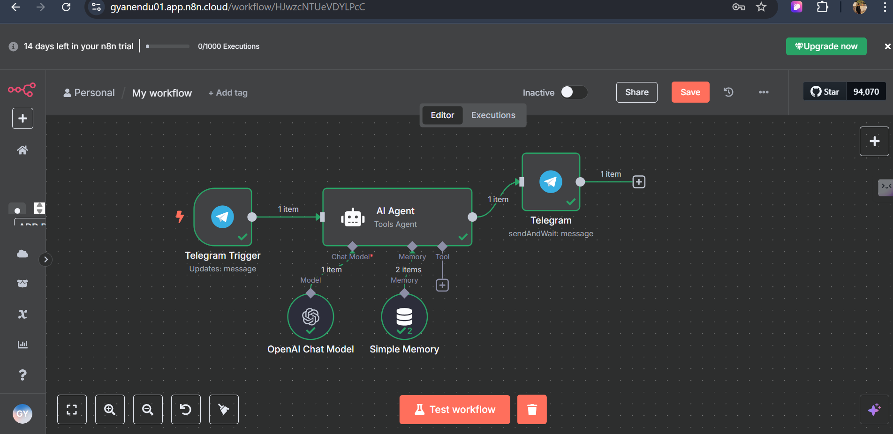
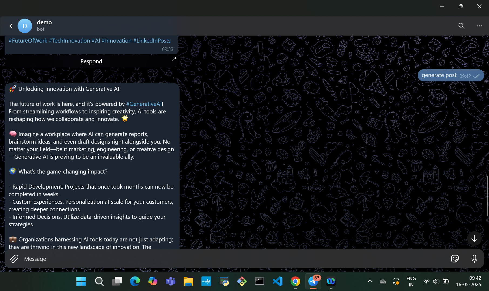
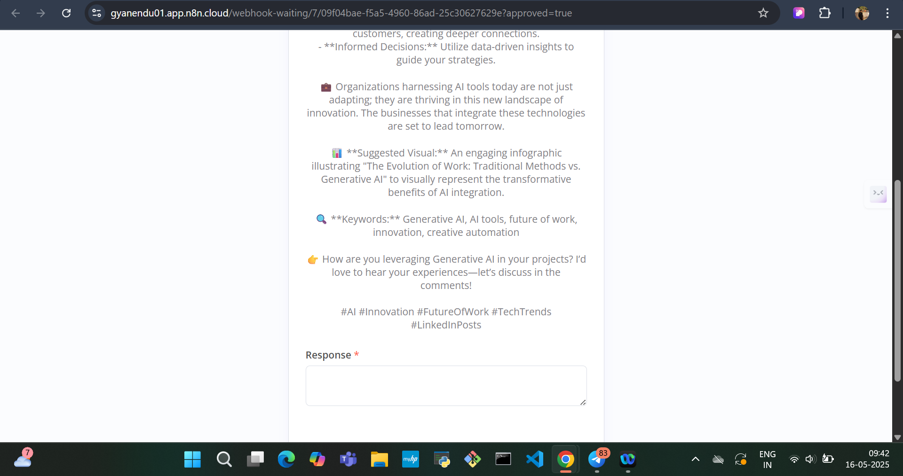

# 🤖 LinkedIn Post Generator Bot with n8n + Telegram

Automate your LinkedIn content creation with this **n8n-powered Telegram bot**. Generate professional, AI-crafted LinkedIn posts in seconds – no more writer’s block or wasted time!

---

## ✨ Features

- 🧠 **AI-powered Post Generation**  
  Automatically generate SEO-friendly LinkedIn posts using generative AI.

- 📲 **Telegram Bot Interface**  
  Chat-based input makes it super easy to create posts from anywhere.

- ⚙️ **n8n Workflow Automation**  
  Seamless integration between Telegram, AI API (like OpenAI), and post formatting.

- 📋 **Copy, Paste & Post**  
  Get a clean LinkedIn-ready post you can directly paste and publish.

---

## 🚀 How It Works

1. You send a message or prompt to the Telegram bot.
2. n8n triggers a workflow.
3. The prompt is sent to an AI (e.g., OpenAI's GPT).
4. The generated LinkedIn post is sent back to your Telegram chat.
5. Copy the post → Paste it on LinkedIn → Done!

---

## 📦 Tech Stack

- [n8n](https://n8n.io/) – No-code/low-code automation platform
- [Telegram Bot API](https://core.telegram.org/bots/api) – Messaging interface
- [OpenAI](https://platform.openai.com/) – For generating the content
- Webhooks, HTTP Requests, and formatting logic – All built inside the n8n workflow

---

## 🖼️ Demo

> *Visual: Telegram → n8n → AI → LinkedIn-ready post*
